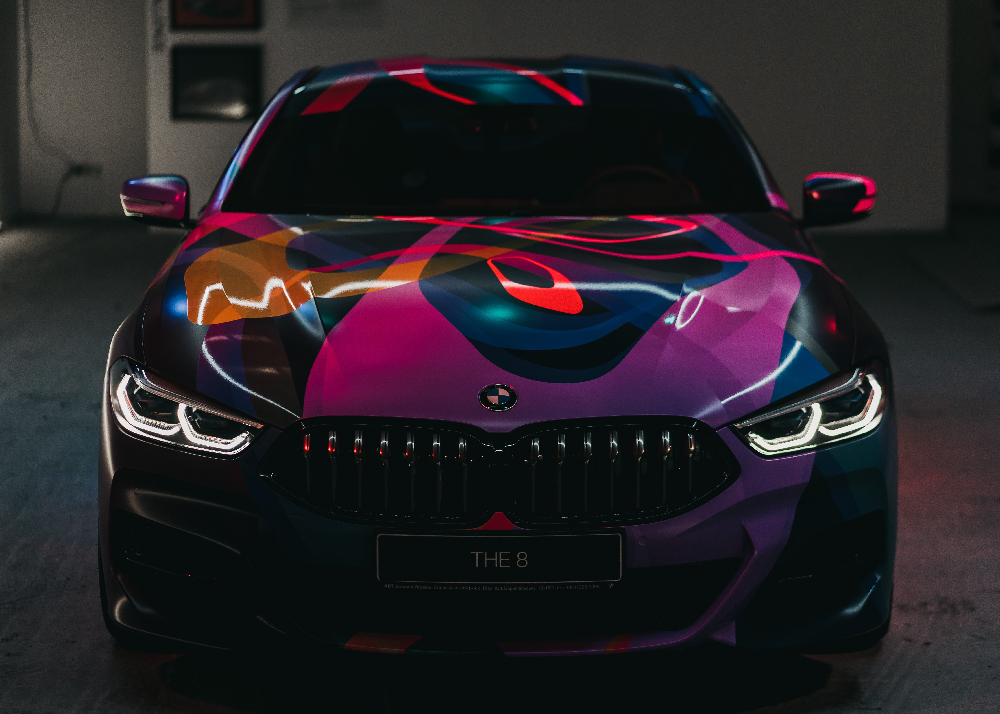

Ah, car adverts. We've all seen them. We've all ignored them and glanced down at our phones to avoid them. Like most adverts, they're boring and don't co-exist efficiently with our continuously decreasing attention spans.

But there is a more sinister side to them. This sinister approach has been in front of our eyes this whole time in the form of the typography.

I guarantee that last sentence has confused you, but never fear, I am here to elaborate!

## **How Typography Manipulates The Mind**

When we think of car adverts, we think of a sleak, clean cut technological masterpiece gliding through an elegant mountain road or an empty, yet perfect city centre, being driven by a guy with a gargantuan smile plastered across his giddy face. Sound about right?

Well, car adverts are actually heavily influenced by it's typography and the text that is used throughout it's course. This can range from quotes from reviews, awards the car and/or manufacturer has received, and inspirational sentences that can make potential customers feel heroic, indestructible and like they're part of a wider family of people who drive cars produced by that particular manufacturer.

The text itself that represents these examples is never too large on the screen, as this would distract the viewers from the car that is being advertised. The car is rarely, if ever, not at the centre of the advert, and this is done by placing the text efficiently and carefully at different points on the screen, in a way that gives the typography its own spotlight, alongside the car on show. 

Everything is structured in a extremely effective manner, and car manufacturers do deserve credit for this.

## So What's The Big Deal?

I can hear you asking 'What's the big deal then? The car manufacturers are doing a good job. You just said so yourself.'

Yes, I am aware, and none of the aforementioned examples of how typography is used in car adverts sound sinister in any capacity.

The sinister approach typically rears its ugly head at the end of the adverts.

You may have noticed at the bottom of your television screens that a series of lines composed of wispy, white, blurry text appears. You've most likely never taken the time to read it due to the difficulty in seeing each letter. This is a result of the text itself being extremely lightweight and condensed, and the squalor being at an all time maximum. The contrast will be very high too. All of these factors result in the least legible form of digital text possible.

There is a reason for this too.

As previously stated, car manufacturers are very good at effectively using typography, however, their intentions are not always admirable. 

This blurry text is usually comprised of all the legal and complicated bits that the car manufacturers are required to inform their customers about. However, these pieces of information can sometimes deter people away. Obviously, the car manufacturers will not want this to happen, so in order to prevent potential customers from being put off, the typography that is used to display these pieces of information is usually produced in a way that makes the information itself particularly difficult to read.

Who in their right mind is going to pause the advert, get up from their sofa, squint their eyes, and read that text?

Car manufacturers know this and it's why they do it, but at the same time, they're abiding by the law because at the end of the day, they are showing all of the relevant information. 

## In Conclusion

Car manufacturers are able to keep themselves clean in the eyes of the law, prevent customers from being scared off by the legal information, and use powerful and inspirational quotes to make their cars seem amazing.

How are all of these objectives carried out in the best possible way? The typography of course!

The subject of car adverts is fantastic for showcasing the true power of typography. From the colour, font size, placement, animations; typography truly is capable of great things. It can display information, motivate the potential customers, and add several new dimensions and discussion points to an advert. 

But ultimately, it comes down to the intentions of the car manufacturer, and I implore you to remember this the next time you see an advert for a car.

