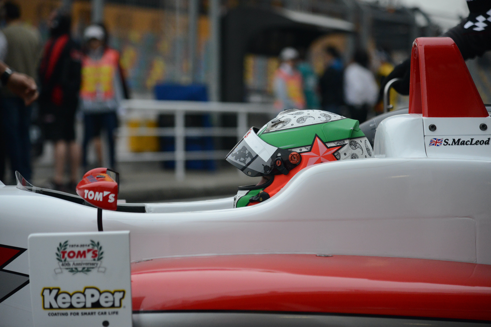

## What Are Sponsors In Motorsport?

Motorsport is an extremely expensive industry for everyone involved and needs thunderous amounts of money to be pumped into it to keep it alive. This mostly affects the drivers in the junior ranks as they are usually the ones who are required to bring the finances to a team for that team to operate and compete. 

But where do they get their money from I hear you ask? The answer is simple: sponsors.

In an extremely simplified and time-saving sense, sponsors are businesses who will sign deals with drivers in order to fund them for a specific number of seasons and in return the company will receive a certain level of representation on the racetrack, depending on the amount of funding they are providing the driver with. There are a few different types of sponsorship packages that can be arranged:

Of course, the name of each package being offered is completely team and/or driver dependent, so let's just refer to them as: Gold, Silver, and Bronze. 

Gold is the most expensive package a sponsor can opt for and will see the company name be integrated within the team name, i.e., Carlin Buzz Racing, as well as potentially having the car livery be the same as the company colours for maximum representation. The sponsor will receive plenty of benefits and perks too, such as track days, lots of hospitality tickets, and have access to having the driver/s take part in promotional events for the company. 

Silver is the middle-ground, your company name and logo can make an appearance on the teams' cars and race suits, as well as the drivers' crash helmet, and will typically be quite big so that they are noticed, but the company will not be able to influence the teams' colours. Track days, hospitality tickets and driver access may also be provided as a part of this package, but to a significantly smaller quantity.

Bronze is at the lower end of the motorsport sponsorship package tier list and is therefore typically the cheapest option a company can opt for when sponsoring in the junior motorsport series. For this type of sponsorship, track days, hospitality and driver access will once again be decreased, or maybe even non-existent. Your logo will make an appearance on the car, suit and helmet, but it will be far smaller and most likely will not be the main focus of any designs. Your logo will likely be in places where they are a little bit more difficult so see, compared to the Silver package.

Drivers will often have a management team working on their behalf to approach sponsors and arrange the deals, but that's not to say the driver's are not involved, as they need to provide the sponsors with the incentives to sponsor them in the first place. There are several incentives that a driver can offer a company, as previously mentioned, and typography is an incredibly integral part of how these deals come to fruition.

## The Typography in Motorsport Sponsorship

There is no definitive answer or explanation to accurately detail how typography is used in motorsport sponsorship, as every single individual case differs between team, sponsor, series, regulations, etc. Therefore, the best way to analyse how this kind of thing works is to discuss some real life examples.

One brilliant example is ADAC F4 and Italian F4 champion Oliver Bearman and his title sponsor Aventum. Ollie spent the 2021 season driving for Van Amersfoort Racing in both F4 series, as well as Fortec Motorsport in the GB3 Championship. Of course with both Van Amersfoort and Fortec having different colours, the company logo would had to have been adapted to avoid any kind of colour clash. 

In GB3, his car was white and navy blue to represent the colours of Aventum, therefore giving them maximum representation in front of the tens of thousands who attended the race weekends he was racing at. 

In the F4 championships, the picture was a little different because Van Amersfoort are a huge name in the junior series, so they were most probably reluctant to make any changes to their traditional black and orange livery, but there is one thing this livery had in common with the GB3 livery: the typography.

In all of the series Ollie raced in, the Aventum logo followed the exact same typographic principles. The difference between the baseline and cap-height was standard, so not too spread out, nor was it too compressed. The text was relatively lightweight and had regular width to give the name a very clean and sleek look, perhaps this being an indication of Aventum's values in that nothing will go waste and only what is needed shall be used. Aventum was also written in a rather tentative way with regular contrast to help emphasise the evidently clean clear-cut approach they were trying to convey.

Aventum's approach to sponsoring Oliver Berman's 2021 race cars is incredibly different to the case of Red Bull backed Jonny Edgar in FIA F3.

Jonny's FIA F3 Dallara 2019 was dominated by Red Bull colours, but of course the most fascinating part here were the typographic decisions that were made. The difference between the baseline and cap-height was far bigger than Aventum's, and the width was extended considerably, therefore helping the Red Bull name take up much more space alongside the sidepod of Jonny's car. The weight of the text was also rather heavy, which coincides with the emphatic text variable to ensure the Red Bull name stands out as much as possible and is almost guaranteed to catch the viewers' eyes. The high contrast also helps give the Red Bull name its own personal touch too, perhaps giving the company a slightly more sophisticated image when Jonny's car is seen on the TV screens.

## Is There a Right Approach to Typographic Decisions in Motorsport Sponsorship?

Absolutely not, unless the company name is completely unintelligible, you can't go wrong in this aspect. The purpose here is to propel the company name out into the world and get as much exposure as possible, so it's down to the company themselves on how they'd like to approach sponsoring a driver. The amount of time and consideration they put into the typography of the company logo, and how it is going to look on the car will determine how beneficial this strategy will be for the company. We have examples of two different sponsors conducting two different typographic approaches to sponsorship, and not one appears to be that much better than the other.