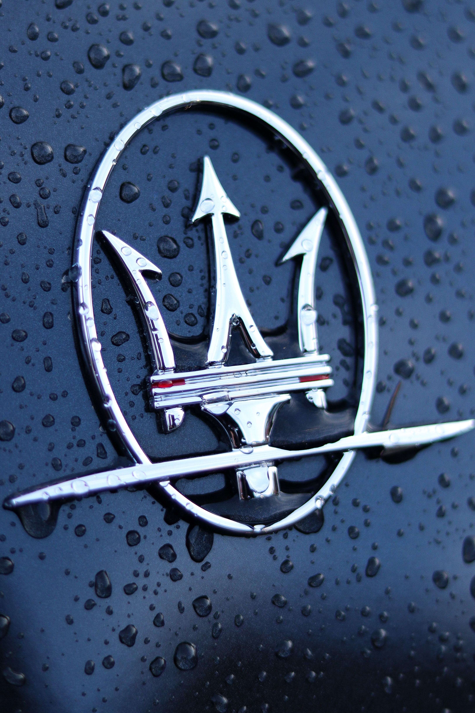
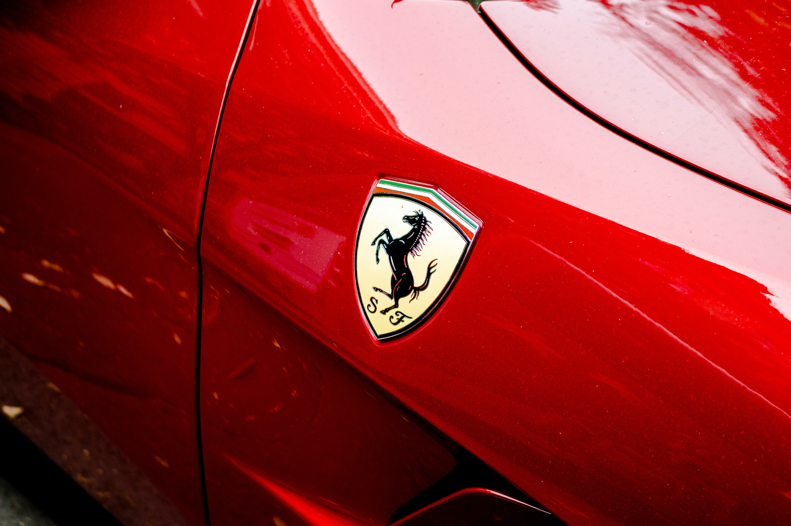
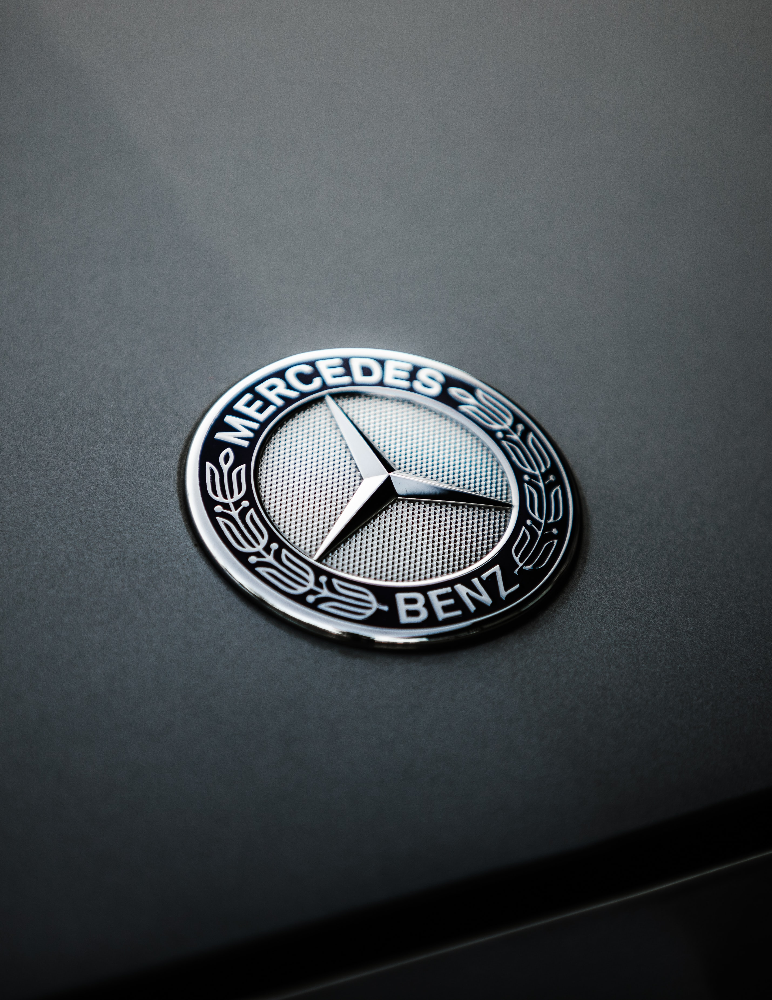
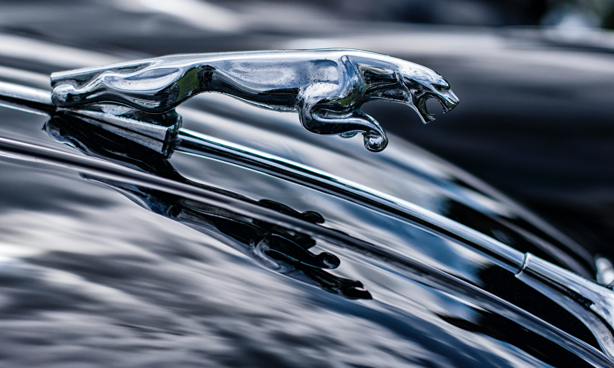
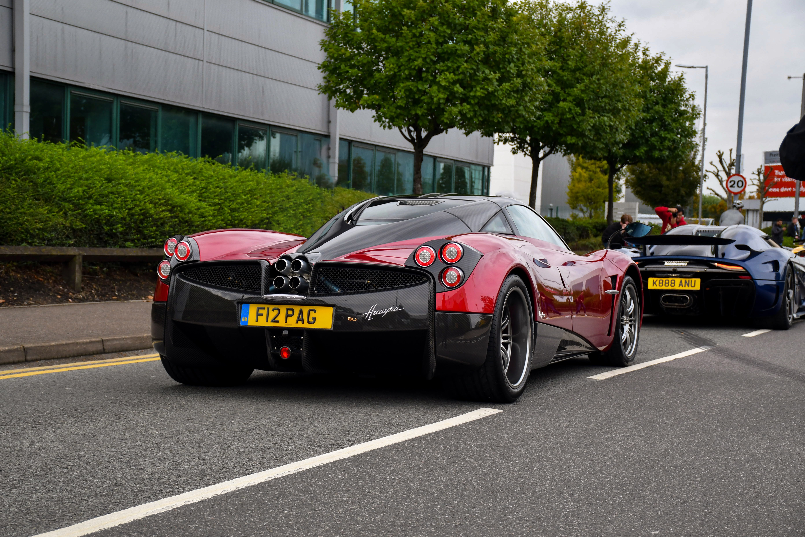

The automobile industry is thought of as being traditionally masculine, with almost all car manufacturers having been founded by men. But many other important questions remain unanswered, such as, how do brands use typography to represent themselves? And how do they use it to convey a message of luxury, alongside speed, power and precision?

## Maserati

Maserati prides itself on it's long and glorious sporting heritage, and this is reflected significantly in their logo's typography. 

The typography in this logo screams class and luxury to let potential customers know that when they're purchasing a Maserati, they're buying into a long line of fantastic Italian automotive excellence. 

There is a consistent x-height across the entire logo involving all of the lower case graphemes which makes the logo look extremely neat and sophisticated. It also adds an impressive level of professionality to the logo. The weight is rather regular as it doesn't want to stand out and be too impactful, but rather sensible and reserved, like the luxury reputation Maserati are trying to convey. The typographical width is somewhat extended to give the typography a little bit of personality so that it's not completely boring and uncharacteristic. Maserati have opted to use a font that I actually cannot identify as I've never seen it before. It's so incredibly unique and different that it portrays Maserati as being of the upmost class and quality, to the point where other car brands will not be able to replicate them in any capacity, not even with their brand logos. This again gives Maserati a supreme amount of individuality.

## Ferrari

## Mercedes-Benz

## Jaguar

## Pagani

