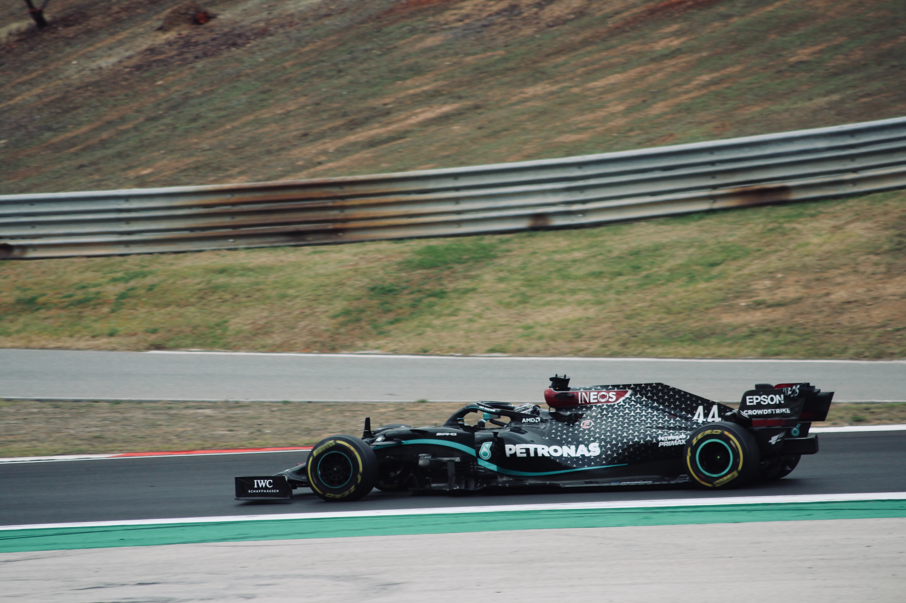
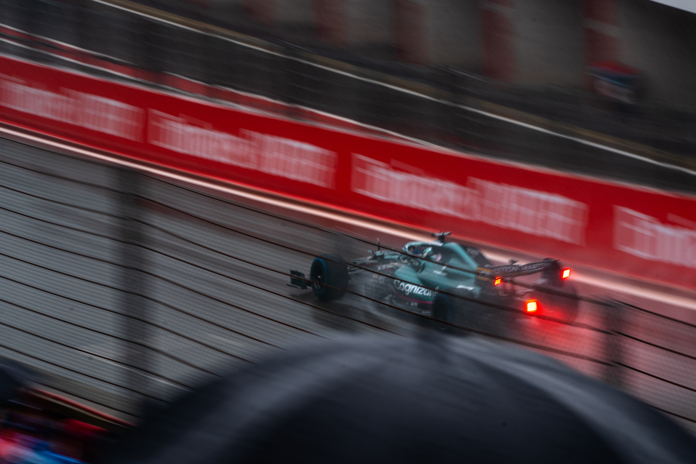

We are in the year 2021, and now more than ever, society is breaking down the barriers have restricted and oppressed far too many people for far too long. In the last 20 years, more changed has occurred than the 2000 years before that, from the legalisation of same-sex marriages, to the more open-approach to mental health treatment (particularly in young men).

Whilst there are of course plenty of people taking this progressive social switch way too far, lots of good is being done, and racing drivers are contributing to these great changes just like the rest of us.

## Lewis Hamilton

If there is one driver who has used typography to the maximum to help spread messages pushing for social reform, it's Lewis Hamilton. The 7-time world champ has been working tirelessly to push for changes in the societal areas he feels are most in need of change, and the stand out example is the BLM movement. 

Before each grand prix, the drivers stand at the front of the grid to show their unification against racism, and Hamilton has made the decision to wear a different t-shirt each race with a different message on the front. Each message is a sentence of a longer pro-BLM poem that he has been constructing alongside young black artists from across the globe. 

The typography is interesting to say the least because the designs do not stick to the same rules. Every new t-shirt comes with a new design, as well as a new typographic approach compared to the previous t-shirts. The biggest difference is most certainly the typographic voice variables. There doesn't appear to be any design-related continuity between the t-shirts and this is allegedly a way for Hamilton to show everyone that despite everyone having their own differences and individual qualities; at the end of the day we are all the same with the same purposes. 

