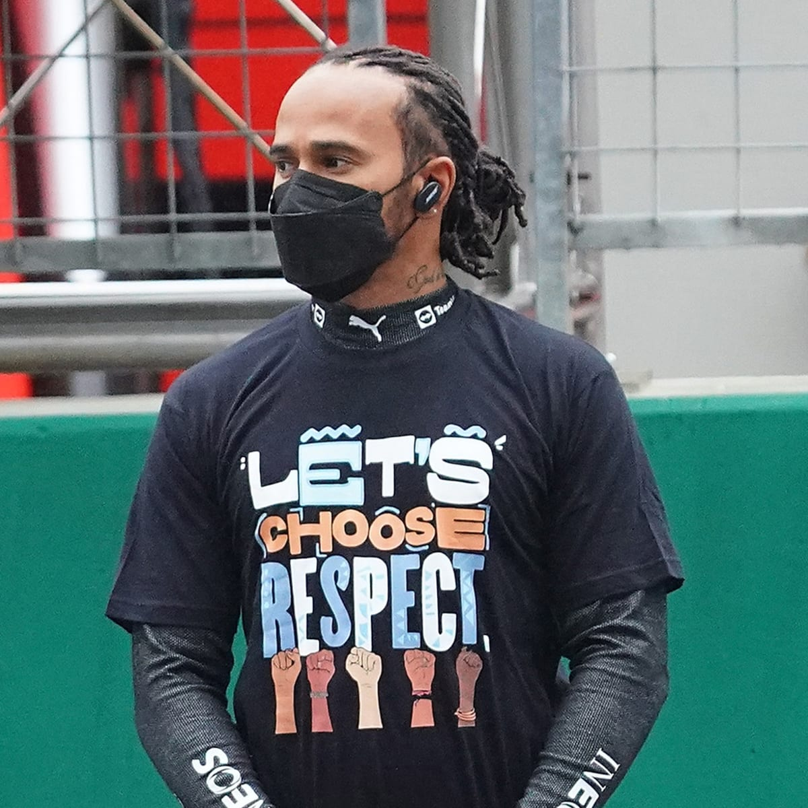
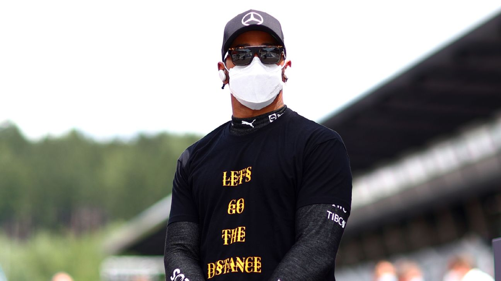
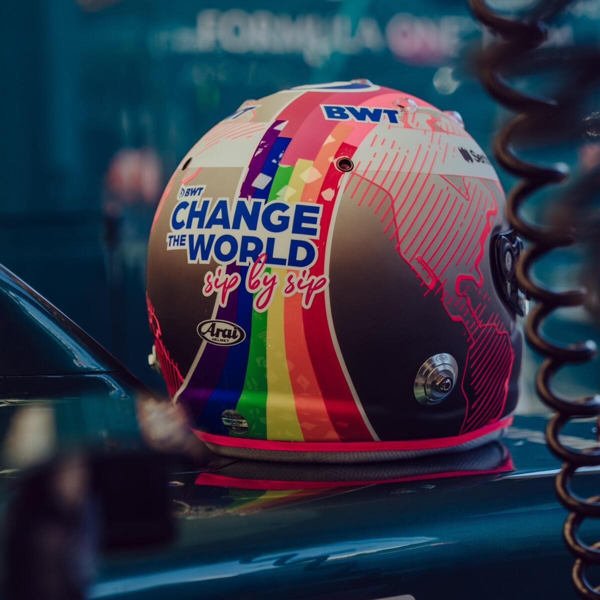

We are in the year 2021, and now more than ever, society is breaking down the barriers have restricted and oppressed far too many people for far too long. In the last 20 years, more changed has occurred than the 2000 years before that, from the legalisation of same-sex marriages, to the more open-approach to mental health treatment (particularly in young men).

Whilst there are of course plenty of people taking this progressive social switch way too far, lots of good is being done, and racing drivers are contributing to these great changes just like the rest of us.

## Lewis Hamilton

If there is one driver who has used typography to the maximum to help spread messages pushing for social reform, it's Lewis Hamilton. The 7-time world champ has been working tirelessly to push for changes in the societal areas he feels are most in need of change, and the stand out example is the BLM movement. 

Before each grand prix, the drivers stand at the front of the grid to show their unification against racism, and Hamilton has made the decision to wear a different t-shirt each race with a different message on the front. Each message is a sentence of a longer pro-BLM poem that he has been constructing alongside young black artists from across the globe. 

The typography is interesting to say the least because the designs do not stick to the same rules. Every new t-shirt comes with a new design, as well as a new typographic approach compared to the previous t-shirts. The biggest difference is most certainly the typographic voice variables. 

Here are but a few of these examples:

As there doesn't appear to be any design-related continuity between the t-shirts and this is allegedly a way for Hamilton to show everyone that despite everyone having their own differences and individual qualities; at the end of the day we are all the same with the same purposes. 

## Sebastian Vettel

Another driver who has been using typography to help break down societal barriers is four time world champion and Aston Martin Cognizant F1 driver Sebastian Vettel. 

His approach has been different from Lewis Hamilton's however, because whilst it involves designing clothing around a certain message, it does involve t-shirts, but rather the crash helmet on which he used to race at the Hungarian GP back in August. 

For that particular weekend, Vettel opted to race with a rainbow-themed helmet to show his support for the LGBT community in response to the latest anti-LGBT laws that were recently passed by the Hungarian government, with regards to the restriction of LGBT-related education for schoolchildren. The rainbow on this helmet was also mixed in with the light pink of Aston Martin's sponsor BWT with these pink lines forming the outlines of the continents of planet earth, hereby showing a sense of worldwide unity.

The typography that was used on this lid follows the typographical decisions made by BWT in terms of the company's name in logo, but irrespective of where these decisions were made, the text on Vettel's crash helmet was extremely visible for all fans to see.

All of the blue graphemes had the same, large distance between the cap height and baseline to help the message  take up as much space as Vettel felt it needed. This text was rather heavyweight and had regular width too, giving it a thick and impactful look across the back where it was placed.

The pink text just below, however, follows a completely different typographical approach. The space between the baseline and cap height is inconsistent, plus, the regular weight and more condensed width regarding the word spacing gives this part of the typography a much more raw and handwritten, luxury feel.

These contrasting typographic approaches co-exist incredibly, it must be said, and do a great job at conveying Vettel's pro-LGBT message. 

