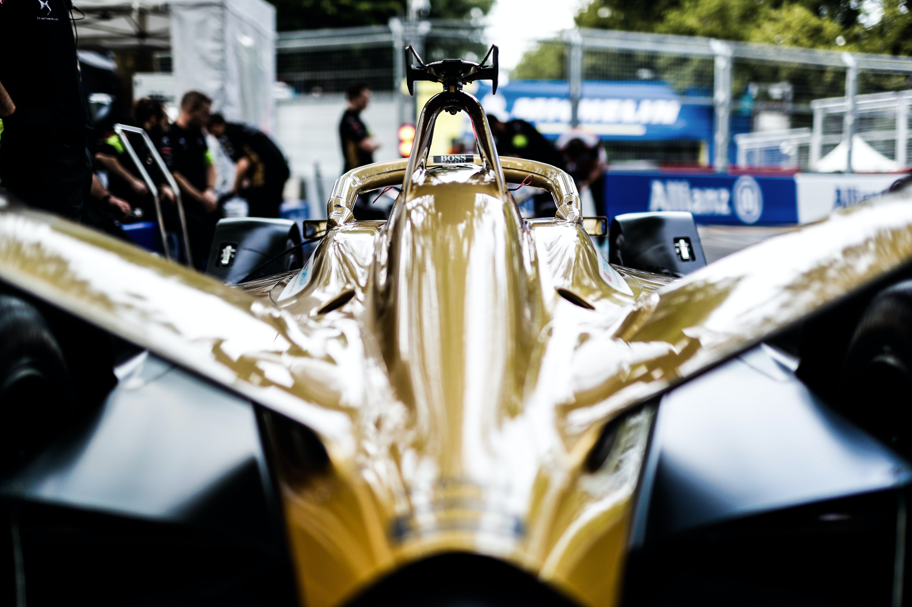

Two World Champions have been crowned in motorsport this weekend: Oscar Piastri in FIA Formula 2 and Max Verstappen in F1 (at least for the time being as it has just been announced that his title is under threat after Mercedes have lodged two appeals, one against the decisions of Michael Masi the race director and the other against Verstappen himself for overtaking Lewis Hamilton under the safety car). Both drivers have been superb in their respective championships, simply outclassing their competitors and delivering in the races when it mattered the most.

The world of motorsport social media is always abuzz with news, insight and opinions, but now that the two most prestigious championships under the guise of the FIA have been won, they will be using typography to honour both drivers, as well as gain as much attention and followers for the manners in which they honour them.

## The Champions Dress to Impress... in the Social Media Posts Honouring Them

Now whilst I am unable to show the relevant social media posts from their official Instagram pages, the social media accounts for F1, F2 and even F3 all use the same layout and typography when posting about their champions, and these are the examples I feel are appropriate to analyse when discussing how the newly crowned champions of some of the FIA series are portrayed and honoured.

The typographic decisions made by the administrators of these accounts are brilliant as they help add a new, perhaps previously unseen dimension to the posts, without adding any unnecessary complexity to their followers. 

This can be seen first and foremost by the text of the posts all seemingly sharing an identical distance between the cap-height and baseline. This similarity dramatically increases the legibility of the text because it helps all of the graphemes appear in a much more simplistic and efficiently structured way, as well as giving the typography a relatively satisfying outlook, regarding its actual placement on the post. 

Furthermore, the heavier weight and low contrast of the phrase 'World Champion' helps the typography appear in a significantly more emphatic manner, as it signals the importance of it existing on the post as it helps to describe in a short and simple way what the post is about, whilst at the same time, effectively ensuring that the typography does not clash with the images in the background, that all come together to form an epic collage of the champion in question. Also, the low contrast in particular ensures that the typography does not necessarily steal the limelight, and that the images in the background receive just as much attention. It helps present the typography and also the collage in the background as being of equal importance.

## However, Over in Formula E...

There is one stark contrast between how the champions of F1, F2 and F3 are honoured by the typography on the relevant social media accounts, to that of the champion of the Formula E series. Not in terms of the quality of the typography itself, but rather how the typography is influenced by the premise and themes of the series.

Formula E is a new(ish) championship that was created in 2014 and is the worlds first all-electric racing car championship, and the typography used in the aforementioned posts are electrically themed.